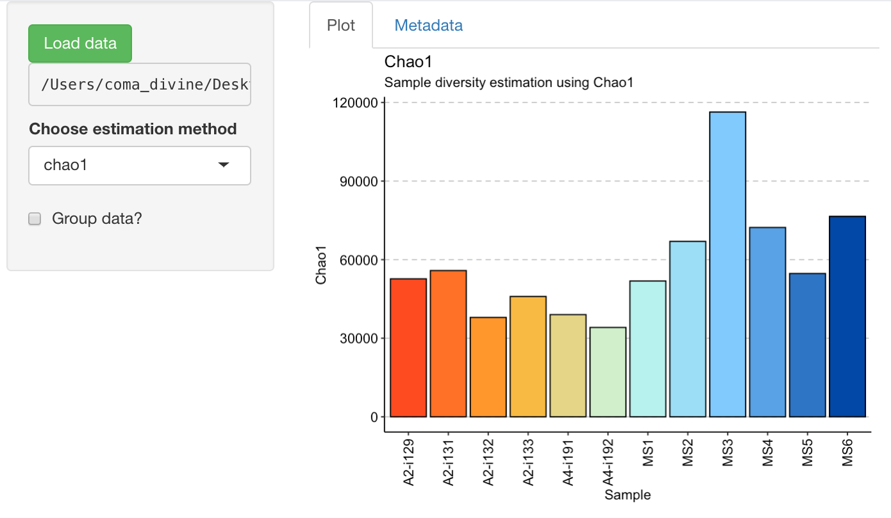
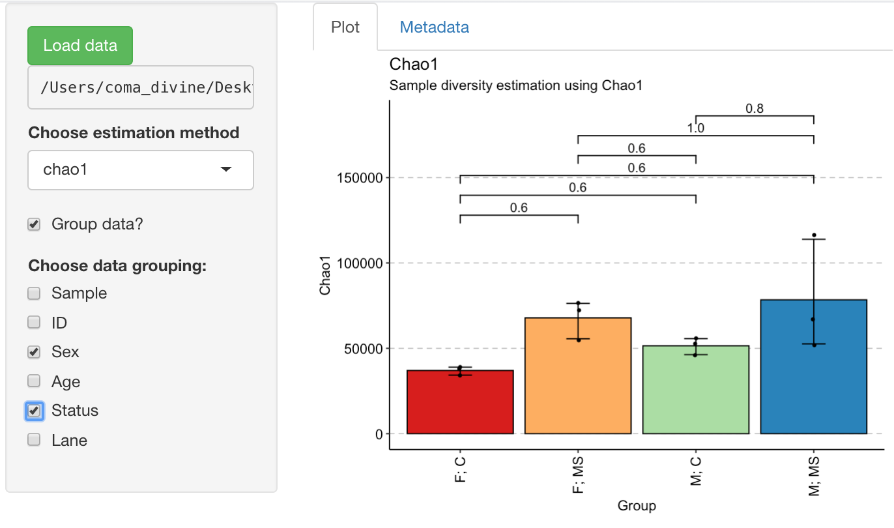

# `immunarch-shiny` - A Shiny application for visualizing immune repertoire statistics

## Introduction
`immunarch-shiny` is a simple application allowing user to upload their data and immediately get plots for various immune repertoires features. Currently only diveristy estimation is available.

## Project Goals
- Make possible analysis of immune repertoires without R knowledge
- Speed up the process of scientific insights generation

## Requirements
Imports:
    heatmap3 (>= 1.1.6),
    ggrepel (>= 0.8.0),
    reshape2 (>= 1.4.2),
    factoextra (>= 1.0.4),
    fpc,
    circlize,
    MASS (>= 7.3),
    Rtsne (>= 0.15),
    readr (>= 1.3.1),
    readxl (>= 1.3.1),
    shiny (>= 1.4.0),
    shinythemes,
    treemap,
    airr,
    ggseqlogo,
    UpSetR (>= 1.4.0),
    stringr (>= 1.4.0),
    ggalluvial (>= 0.10.0),
    Rcpp (>= 1.0),
    magrittr,
    tibble (>= 2.0),
    methods,
    scales,
    ggpubr (>= 0.2),
    rlang (>= 0.4),
    plyr,
    dbplyr (>= 1.4.0)
Depends:
    R (>= 3.5.0),
    ggplot2 (>= 3.1.0),
    dplyr (>= 0.8.0),
    dtplyr (>= 1.0.0),
    data.table (>= 1.12.6),
    gridExtra (>= 2.2.1),
    immunarch (>= 0.5.5)
Suggests:
    knitr (>= 1.8),
    roxygen2 (>= 3.0.0),
    testthat (>= 2.1.0),
    pkgdown (>= 0.1.0),
    assertthat,
    sparklyr (>= 1.0)

## Instructions
Launch Shiny app from terminal:
```
R -e "shiny::runApp('path/to/shiny/app')"
```
Then go connect to app in browser navigating to address and port from terminal.
Alternatively, you can open application code in R Studio and launch by `Run App` button.

## Examples
1) Basic example, showing diversity between all samples in test dataset, estimated using Chao1.

2) Samples grouped by sex and status:


## References
- R programming language (https://r-project.org/)
- `Shiny` framework (https://shiny.rstudio.com/)
- Mastering Shiny, tutorial under early development (https://mastering-shiny.org)
- `immunarch` package for immune data analysis (https://immunarch.com/)
- Miho, E., Yermanos, A., Weber, C.R., Berger, C.T., Reddy, S.T. and Greiff, V., 2018. Computational strategies for dissecting the high-dimensional complexity of adaptive immune repertoires. Frontiers in immunology, 9, p.224.

## Authors
Shamil Urazbakhtin - shamil.utaraptor@gmail.com